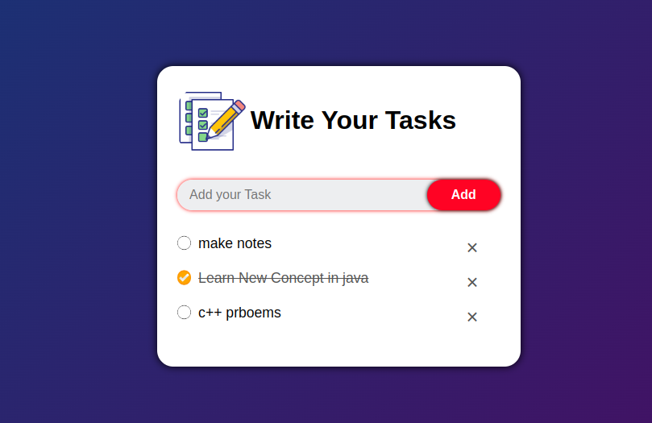

# To-Do List
Resposive-To-Do-List-WebApp,TaskManager,to-do-list,task-manager,javascript,html,css,web-development,project

A simple to-do list application built using HTML, CSS, and vanilla JavaScript.

## Description

This project is a basic to-do list application that allows users to add, edit, and delete tasks. It is designed to be lightweight, easy to use, and customizable.

## Features

- Add new tasks
- Mark tasks as completed
- Edit task details
- Delete tasks
- Filter tasks by status (completed or pending)
- Responsive design for mobile and desktop devices

## Screenshots

Include screenshots or GIFs showcasing the application's user interface and features.



## Usage

1. Clone the repository:

```bash
git clone https://github.com/your-username/to-do-list.git

a comprehensive to-do list manager GitHub repository. TaskMaster is built using JavaScript, HTML, and CSS, making it an ideal project for web development enthusiasts. As a powerful task tracker and organizer, TaskMaster empowers users to efficiently manage their daily tasks and projects. With its user-friendly interface and robust features, TaskMaster simplifies task management by allowing users to add, edit, and delete tasks effortlessly. Whether you're a beginner or an experienced developer, TaskMaster serves as an excellent project to explore web development concepts while building a practical task app. Experience the convenience and organization provided by TaskMaster - your go-to solution for effective task management.
